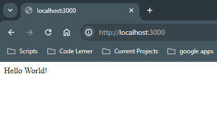

# Hello World Web Server

This is a simple Node.js web server that returns "Hello World" using the Express framework.

## Getting Started

These instructions will get you a copy of the project up and running on your local machine for development and testing purposes.

### Prerequisites

You need to have Node.js and npm installed on your local machine.

- [Node.js](https://nodejs.org/)
- [npm](https://www.npmjs.com/)

### Installing

1. Clone the repository:
   ```bash
   git clone https://github.com/coderooz/Hello-World-Web-Server.git
   cd hello-world-web-server
   ```

2. Install the dependencies:
   ```bash
   npm install express
   ```

3. Start the server:
   ```bash
   node index.js
   ```

### Usage


Open your browser and go to `http://localhost:3000`. You should see "Hello World!".



### Built With

- [Express](https://expressjs.com/) - The web framework used

### Contributing

Please read [CONTRIBUTING.md](CONTRIBUTING.md) for details on our code of conduct, and the process for submitting pull requests to us.

### Versioning

We use [SemVer](http://semver.org/) for versioning. For the versions available, see the [tags on this repository](https://github.com/coderooz/hello-world-web-server/tags).

### Authors

- **Ranit Saha** - [Coderooz](https://github.com/coderooz)

### License

This project is licensed under the MIT License - see the [LICENSE.md](LICENSE.md) file for details
